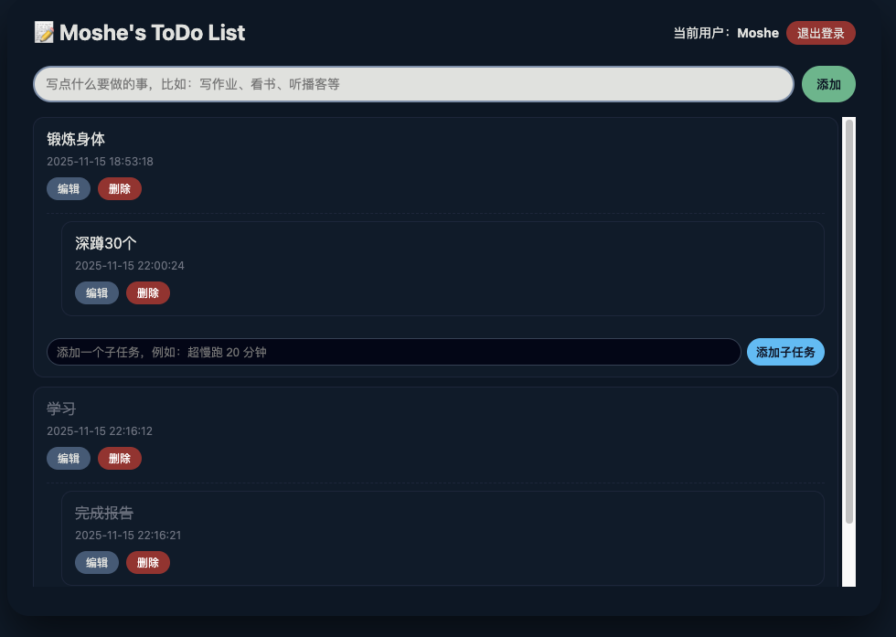

# 📝 Moshe’s ToDo List · 全栈任务清单应用

一个由 Vue3 + Spring Boot 驱动、支持多用户登录的全栈 ToDo 应用。
界面采用深色沉浸式 UI，专注、优雅、干净，是你迈向全栈开发的第一款完整作品。

⸻

## 🌙 UI 预览

<p align="center">
  
  <br>
  <em>极简深色主题 · Moshe 自主设计与实现</em>
</p>


⸻

## 🚀 功能介绍

## 🔐 多用户系统

​	•	支持用户注册、登录
​	•	登录状态本地持久化
​	•	不同用户拥有各自独立的 ToDo 列表
​	•	自动过滤并返回当前用户的任务

## 🧾 待办事项管理

​	•	添加任务
​	•	修改任务内容
​	•	标记完成 / 未完成
​	•	删除任务
​	•	自动记录创建时间与更新时间

## 🎨 现代深色 UI

​	•	卡片式任务列表
​	•	柔和圆角 + 阴影效果
​	•	输入框、按钮、标签精心配色
​	•	自适应滚动：页面固定不动，列表区域可滚动

## ⚡ 快速高效的技术架构

​	•	前端： Vue 3（Composition API）+ Vite + Axios
​	•	后端： Spring Boot 3 + MyBatis-Plus（自动 SQL）
​	•	数据库： MySQL
​	•	工具链： IntelliJ IDEA、VS Code、Git、GitHub

⸻

## 🛠 技术栈

层级	技术
前端 Frontend	Vue 3 · Vite · Composition API · Axios
后端 Backend	Spring Boot · MyBatis-Plus · Lombok
数据库 DB	MySQL 8
开发工具	IntelliJ IDEA · VS Code · GitHub


⸻

## 📁 项目结构

```
ToDoList/
├── todo-frontend/       # Vue3 + Vite 前端
│   ├── src/
│   └── index.html
│
├── todo-backend/        # Spring Boot 后端
│   ├── src/main/java/com/moshe/todolist/
│   ├── application.yml
│   └── pom.xml
│
└── README.md

```


⸻

## 📦 本地运行

1. 克隆项目

git clone https://github.com/JustinFoxy/ToDoList.git

2. 启动后端（Spring Boot）

进入后端目录：

cd todo-backend
mvn spring-boot:run

启动成功后后台接口地址：

http://localhost:8080

3. 启动前端（Vite）

进入前端目录：

cd todo-frontend
npm install
npm run dev

默认运行：

http://localhost:5173


⸻

## 🙌 开发者

Moshe (JustinFoxy)
热爱编程、摄影、嵌入式与创造力的全栈入门开发者。
坚持把课程项目变成 真正在线上可运行的工程。

GitHub: JustinFoxy
Email: JustinFoxy0701@gmail.com
